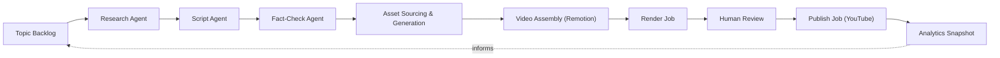

# AI Content Production Engine

[](https://github.com/nikamrohit18/ai-content-production-engine/actions/workflows/ci.yml)


A production-grade, AI-driven pipeline for running faceless YouTube channels at scale. It takes a topic from idea to published video — research, scripting, fact-checking, asset generation, rendering, and publishing — with cost tracking and human review gates built in, across multiple channels and niches.

The first channel built on this engine is **[Time Excavated](https://www.youtube.com/channel/UCSJSdi3FmUJXF0C1ie_VWaA)** (forgotten history, ancient civilizations, historical mysteries).

The operator dashboard is live at **[ai-content-engine.rohitnikam.tech](https://ai-content-engine.rohitnikam.tech)** — authenticated (Clerk), single-operator access only, not a public demo.

## Pipeline



Every stage writes to Postgres (see [`src/db/schema.ts`](src/db/schema.ts)), so the whole production history of a video — sources cited, fact-check verdicts, render costs, reviewer decisions — is queryable and auditable, not just a log line in a workflow tool.

## Tech stack

| Concern | Choice |
|---|---|
| Framework | [Next.js 16](https://nextjs.org) (App Router) on [Vercel](https://vercel.com) |
| Database | [Neon](https://neon.tech) Postgres via [Drizzle ORM](https://orm.drizzle.team) |
| Orchestration | [Vercel Workflow DevKit](https://vercel.com/docs/workflow) — durable, resumable pipeline steps |
| LLM access | [AI SDK v6](https://sdk.vercel.ai) + [AI Gateway](https://vercel.com/docs/ai-gateway) (multi-provider, no vendor lock-in) |
| Dashboard UI | [shadcn/ui](https://ui.shadcn.com) (Base UI primitives) + Tailwind v4 |
| Authentication | [Clerk](https://clerk.com), via the Vercel Marketplace — gates the dashboard, single operator |
| Video rendering | [Remotion](https://www.remotion.dev) |
| Voiceover | [ElevenLabs](https://elevenlabs.io) |
| Object storage | [Vercel Blob](https://vercel.com/docs/storage/vercel-blob) |
| Publishing | YouTube Data API |
| CI/CD | GitHub Actions → Vercel CLI |

## Project structure

```
src/
├── app/
│   ├── (dashboard)/        # Operator UI: review, backlog, channels, costs, analytics (Clerk-gated)
│   ├── sign-in/            # Clerk embedded sign-in (no sign-up route — admin-created users only)
│   └── api/
│       ├── cron/           # Scheduled jobs (trend refill, analytics polling)
│       ├── webhooks/       # Render-complete, YouTube OAuth callback
│       └── workflows/      # Workflow DevKit entrypoints (start pipeline, resume review)
├── proxy.ts                # Route gating (Clerk session check) — Next 16's renamed middleware
├── components/
│   └── ui/                 # shadcn/ui primitives
├── lib/
│   └── require-auth.ts     # Server Action-level auth check (defense in depth alongside proxy.ts)
├── config/
│   ├── channels/           # Per-channel config
│   └── niches/             # Per-niche config
├── db/
│   ├── schema.ts           # Drizzle schema — the source of truth for the data model
│   ├── seed.ts             # Idempotent seed: channels, niche templates, starter backlog
│   └── migrations/
├── engine/
│   ├── ai/                 # Research, scripting, fact-checking
│   ├── compliance/         # Synthetic-media disclosure, licensing checks
│   ├── cost/                # Cost ledger + budget guardrails
│   ├── render/              # Render-target dispatch (Vercel Sandbox / Remotion Lambda)
│   ├── sourcing/             # Trend signal ingestion (YouTube Data API) + asset sourcing
│   ├── voice/                # TTS generation
│   └── youtube/              # Upload, OAuth, quota management
├── remotion/
│   ├── components/
│   └── compositions/        # Video templates rendered per format (short/longform)
└── workflows/
    └── steps/                # Individual durable workflow steps
```

> Not every directory above has code yet — this mirrors the planned architecture. Check `src/db/schema.ts` for what's structurally finalized, and the directories under `src/engine` for what's actually implemented. As of now: `engine/ai`, `engine/cost`, and `engine/sourcing` are implemented; `engine/compliance`, `engine/render`, `engine/voice`, and `engine/youtube` are still empty scaffold.

## Getting started

### Prerequisites

- Node.js 24+
- [Vercel CLI](https://vercel.com/docs/cli) (`npm i -g vercel`), authenticated and linked to this project
- Access to the project's Neon database (provisioned via Vercel Marketplace)

### Setup

```bash
npm install
vercel link              # if not already linked
vercel env pull .env.local
npm run db:migrate        # apply schema to the database
npm run db:seed           # seed channels, niche templates, starter topic backlog
npm run dev
```

`vercel env pull` also pulls Clerk's Development-instance keys, so local dev is authenticated the same way production is — visiting any dashboard route locally will redirect to `/sign-in` until you log in with an account created via the Clerk dashboard (there's no self-serve sign-up).

### Available scripts

| Script | Purpose |
|---|---|
| `npm run dev` | Start the local dev server |
| `npm run build` | Production build |
| `npm run lint` | ESLint |
| `npm run typecheck` | TypeScript, no emit |
| `npm run db:generate` | Generate a new Drizzle migration from schema changes |
| `npm run db:migrate` | Apply pending migrations |
| `npm run db:studio` | Open Drizzle Studio against the linked database |
| `npm run db:seed` | Idempotently seed channels, niche templates, and the starter topic backlog |

## Authentication

The dashboard has no public sign-up — it's a single-operator internal tool, not a multi-tenant product (yet). [Clerk](https://clerk.com) gates every route via `src/proxy.ts` (Next 16's renamed `middleware.ts`), and every Server Action / mutating route handler also checks `requireAuth()` directly (`src/lib/require-auth.ts`), since Server Actions share their page's route and aren't independently matchable by a proxy config — relying on the proxy alone would leave a gap.

Two Clerk instances exist on the same app: **Development** (test keys, used by Preview deployments and local dev) and **Production** (live keys, custom domain `clerk.ai-content-engine.rohitnikam.tech`, used only by the Production environment). Both have public self-serve sign-up disabled — new users are created manually via the Clerk dashboard.

`/api/cron/*` (checked against `CRON_SECRET`, called server-to-server by Vercel Cron) and `/.well-known/workflow/*` (Workflow DevKit's own internal runtime routes) are excluded from the Clerk gate since neither is browser-driven.

## CI/CD

[`.github/workflows/ci.yml`](.github/workflows/ci.yml) runs on every push and pull request to `master`:

1. **`checks`** — install, lint, typecheck, build. Runs for all pushes and PRs, no secrets required.
2. **`deploy-preview`** — on pull requests, builds and deploys a Vercel preview, then comments the URL on the PR.
3. **`deploy-production`** — on push to `master`, builds and deploys to production.

Deploys use the Vercel CLI (`vercel pull` → `vercel build` → `vercel deploy --prebuilt`) rather than Vercel's automatic Git integration, so the entire pipeline — checks and deploys — is visible in the **Actions** tab.

Required repository secrets:

| Secret | Description |
|---|---|
| `VERCEL_TOKEN` | Personal/team access token — [create one](https://vercel.com/account/tokens) |
| `VERCEL_ORG_ID` | From `.vercel/project.json` |
| `VERCEL_PROJECT_ID` | From `.vercel/project.json` |

## Channels

| Channel | Niche | Status |
|---|---|---|
| [Time Excavated](https://www.youtube.com/channel/UCSJSdi3FmUJXF0C1ie_VWaA) | History / ancient civilizations | Live |
| — | Lifestyle | Planned |
| — | Personal finance | Planned |
| — | Health & relationships | Planned |
| — | Tech & business | Planned |

## Roadmap

- [x] Data model for the full topic → publish pipeline
- [x] Database provisioned, migrated, seeded
- [x] CI/CD pipeline
- [x] Research-brief persistence + research agent
- [x] Script generation agent
- [x] Fact-checking agent
- [x] Trend-signal sourcing (YouTube Data API)
- [x] Dashboard UI (review, backlog, channels, costs, analytics)
- [x] Authentication (Clerk, single operator) + custom domain
- [ ] Move research/script/fact-check models off the free-tier model to the production model of choice
- [ ] Asset sourcing & generation
- [ ] Remotion render pipeline
- [ ] YouTube publish + OAuth
- [ ] Analytics polling (currently an empty state — no producer until publishing exists)
- [ ] Second channel (niche TBD)
- [ ] Multi-tenant auth model (current `requireAuth()` is single-operator only — see code comments in `src/lib/require-auth.ts`)

## License

Proprietary — all rights reserved. Source is public for portfolio/transparency purposes; no license is granted for reuse, modification, or redistribution.
